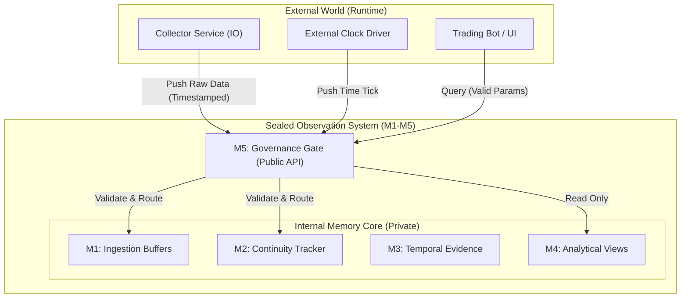

# OBSERVATION LAYER ISOLATION PLAN
**Role:** System Architect Agent
**Date:** 2026-01-06
**Status:** DESIGN DRAFT

---

## 1. Core Architectural Shift
**Current State:** Hybrid Real-Time Application (Mutable Globals + Threading + IO mixed)
**Target State:** **Passive Memory Block** driven by an External Clock.

The Observation System (`M1-M5`) will be moved to a sealed package. It will have **NO** internal threads, **NO** internal clock, and **NO** network IO. It is a data structure, not a service.

---

## 2. Physical Module Boundaries

The code will be physically reorganized to enforce layer isolation.



### Directory Structure Refactor
```text
d:/liquidation-trading/
├── observation/              <-- NEW SEALED PACKAGE (M1-M5)
│   ├── __init__.py           <-- Exposes ONLY M5 Interface
│   ├── governance.py         <-- M5 Implementation (The Gate)
│   ├── internal/             <-- PRIVATE (No external import allowed)
│   │   ├── m1_ingestion.py
│   │   ├── m2_continuity.py
│   │   ├── m3_temporal.py
│   │   └── m4_views.py
│   └── types.py              <-- Shared Data Classes (Immutable)
│
├── runtime/                  <-- EXECUTION LAYER
│   ├── collector/            <-- Handles IO / Websockets
│   ├── native_app/           <-- UI Consumer
│   └── execution/            <-- Trading Logic
```

---

## 3. Explicit Allowed Interfaces (The M5 Contract)

Access to the `observation` package is restricted to these **3 Public Methods** exposed in `governance.py`.

### 3.1. Write: Ingest Event (Driven by Collector)
```python
def ingest_observation(
    timestamp: float,
    symbol: str, 
    event_type: str, 
    payload: Dict
) -> None:
    """
    Push external fact into memory. 
    REJECTS if payload malformed or timestamp < last_seen.
    """
```

### 3.2. Write: Advance Time (Driven by Clock)
```python
def advance_time(
    new_timestamp: float
) -> None:
    """
    Force memory system to recognize time passage.
    Triggers M3 window closures and M2 lifecycle aging.
    """
```

### 3.3. Read: Execute Query (Driven by Consumers)
```python
def query(
    query_spec: Dict
) -> Dict:
    """
    Execute a governed read request.
    
    Validation:
    - Rejects "sort_by: strength" (M5 Rule)
    - Rejects implicit time (Must provide `at_timestamp` if historical)
    - Rejects infinite lookbacks
    
    Returns:
    - Pure Data Dictionary (Stateless)
    """
```

---

## 4. Explicit Forbidden Access Patterns

The following patterns will be made **impossible** by code structure (or strictly policed):

1.  **Direct M1 Access:**
    *   *Forbidden:* `from observation.internal.m1_ingestion import raw_buffer`
    *   *Reason:* Bypasses M5 validation; leaks implementation details.
    *   *Enforcement:* `internal` module naming; `__all__` restriction in `__init__.py`.

2.  **Implicit Clock Usage:**
    *   *Forbidden:* Calling `time.time()` or `datetime.now()` anywhere in `observation/`.
    *   *Reason:* Destroys determinism. Memory must be replayable.
    *   *Enforcement:* Linter rule or rigorous code review (Kill-List Item).

3.  **Global Singleton State:**
    *   *Forbidden:* `SystemState._active` (Global Variable).
    *   *Reason:* Prevents parallel testing / replay.
    *   *Fix:* `ObservationSystem` must be an instantiated class, passed to consumers.

4.  **Mixed Execution Logic:**
    *   *Forbidden:* Importing `GhostAdapter` or placing `buy()` logic inside `observation/`.
    *   *Reason:* Observation must be a pure Description of Reality.

---

## 5. Artifacts to be Moved / Refactored

| Current File | New Location / Role | Action |
|--------------|---------------------|--------|
| `scripts/system_state.py` | `observation/governance.py` | **Rewrite**. Transform data bag into Validation Gate. |
| `scripts/market_event_collector.py` | `runtime/collector/service.py` | **Split**. Remove normalization logic (move to M1). Keep IO. |
| `scripts/trade_promoter.py` | `observation/internal/m3_temporal.py` | **Refactor**. Strip clock usage. Make purely reactive to `advance_time()`. |
| `native_app/` | `runtime/native_app/` | **Update**. Change imports to use `M5.query()` instead of `SystemState`. |

---

## 6. Implementation Strategy (Phase 5 Preview)

1.  **Create new `observation/` skeleton.**
2.  **Implement `M5` Gate stub.**
3.  **Migrate `TradePromoter` logic (M3) behind M5.**
4.  **Migrate `SystemState` counters (M4) behind M5.**
5.  **Refactor Collector to push to M5.**
6.  **Delete old `scripts/` files.**

**Verification:**
The system is deemed "Isolated" when `grep "import execution" observation/` returns nothing, and `grep "time.time()" observation/` returns nothing.
